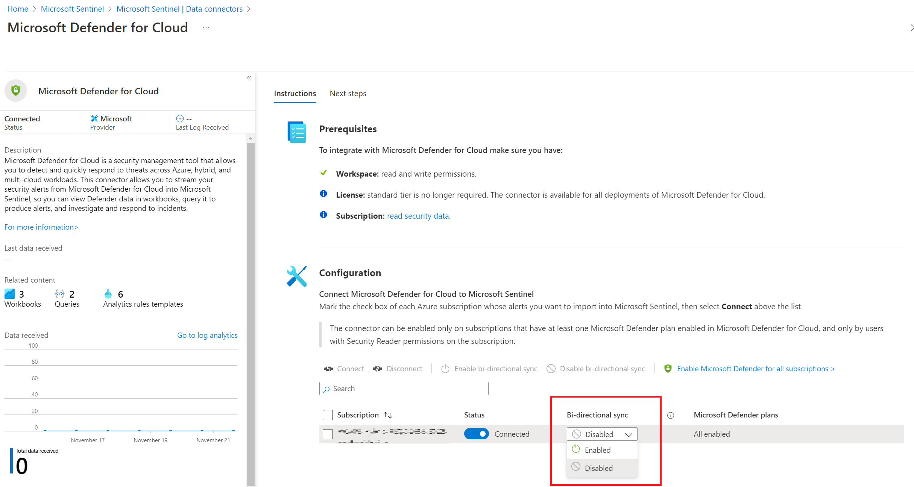

## Enable bi-directional sync for Defender for Cloud Alerts and Sentinel
This is a new feature which got announced at [Ignite 2021](https://techcommunity.microsoft.com/t5/microsoft-sentinel-blog/microsoft-ignite-2021-what-s-new-in-azure-sentinel/ba-p/2175225). It is possible to sync the alerts from Defender for Cloud to Sentinel, and when they are closed in Sentinel, they are closed in Defender for Cloud as well.

### How to enable the bi-directional sync?
In the portal, the bi-directional sync is enabled in Sentinel, in the Defender for Cloud connector:



## How to enable the bi-directional sync in terraform?
Since [version 3.31](https://github.com/hashicorp/terraform-provider-azurerm/issues/18344) it is possible to enable the bi-directional sync with terraform, the feature is documented [here](https://registry.terraform.io/providers/hashicorp/azurerm/latest/docs/resources/security_center_setting).


Create a resource group for the demo:
```terraform
provider "azurerm" {
  features {}
}

terraform {
  required_providers {
    azurerm = {
      source  = "hashicorp/azurerm"
      version = ">= 3.32.0"
    }
  }
}


resource "azurerm_resource_group" "example" {
  name     = "demo-defender"
  location = "northeurope"
}
```

Following the [default terraform setup](https://registry.terraform.io/providers/hashicorp/azurerm/latest/docs/resources/sentinel_data_connector_azure_security_center) for Sentinel with Defender for Cloud connector:
```terraform
resource "azurerm_log_analytics_workspace" "example" {
  name                = "example-workspace"
  location            = azurerm_resource_group.example.location
  resource_group_name = azurerm_resource_group.example.name
  sku                 = "PerGB2018"
}

resource "azurerm_log_analytics_solution" "example" {
  solution_name         = "SecurityInsights"
  location              = azurerm_resource_group.example.location
  resource_group_name   = azurerm_resource_group.example.name
  workspace_resource_id = azurerm_log_analytics_workspace.example.id
  workspace_name        = azurerm_log_analytics_workspace.example.name

  plan {
    publisher = "Microsoft"
    product   = "OMSGallery/SecurityInsights"
  }
}


resource "azurerm_sentinel_data_connector_azure_security_center" "example" {
  name                       = "example"
  log_analytics_workspace_id = azurerm_log_analytics_solution.example.workspace_resource_id
}

```


Enable the bi-directional sync:
```terraform

resource "azurerm_security_center_setting" "example" {
  setting_name = "SENTINEL"
  enabled      = true
}
```

